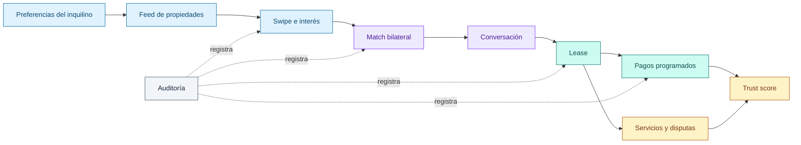

<div align="center">

# bilo

### Del descubrimiento de una propiedad a una relación de alquiler verificable.

Backend de una plataforma residencial que reúne búsqueda por afinidad, acuerdos entre inquilinos y propietarios, pagos y reputación en un mismo recorrido.

<br>

[](https://nodejs.org/)
[](https://www.typescriptlang.org/)
[](https://nestjs.com/)

[](https://www.prisma.io/)
[](https://www.sqlite.org/)
[](https://www.docker.com/)

<sub>REST API · OpenAPI · JWT · Event-driven modules · Docker Compose</sub>

<br>

**[Recorrido](#un-alquiler-completo-no-solo-un-listado) · [Arquitectura](#arquitectura-del-prototipo) · [Ejecución](#ponerlo-en-marcha) · [Documentación](#mapa-de-documentación)**

</div>

---

## Un alquiler completo, no solo un listado

bilo parte de una premisa sencilla: encontrar una propiedad es apenas el comienzo. El producto conecta las decisiones que normalmente quedan repartidas entre portales, mensajería y comprobantes aislados.

| Momento | Qué resuelve bilo | Evidencia en el backend |
| :-- | :-- | :-- |
| **Descubrir** | Ordena propiedades según presupuesto, ubicación y necesidades del inquilino. | Preferencias, catálogo, filtros, recomendaciones y swipes. |
| **Acordar** | Convierte el interés en una decisión bilateral con un canal compartido. | Matches, aceptación del propietario y conversaciones asociadas. |
| **Alquilar** | Conserva el contexto contractual y el historial de cobros. | Leases, métodos de pago, transacciones y eventos de pago. |
| **Construir confianza** | Hace que el comportamiento dentro de la plataforma deje una señal verificable. | Trust score, ratings, disputas, evidencia y auditoría. |
| **Acompañar** | Extiende la relación después de la firma. | Solicitudes de servicio, notificaciones y contexto asistido por IA. |

El repositorio contiene el **prototipo funcional del backend** y, por separado, el diseño técnico y de negocio para llevarlo a producción. El proyecto continúa en desarrollo: la API actual valida el recorrido de producto con SQLite y adaptadores simulados; la documentación define la evolución hacia infraestructura y proveedores reales.

## La trayectoria del producto



## Arquitectura del prototipo

La aplicación es un **monolito modular en NestJS**. Cada dominio expone controladores y servicios propios; Prisma concentra la persistencia; los efectos transversales reaccionan a eventos de dominio en lugar de acoplar los flujos principales.

```text
HTTP / OpenAPI
      │
      ▼
Global JWT guard ──► Controllers ──► Application services ──► Prisma ──► SQLite
                                             │
                                             └── domain events
                                                       │
                                    ┌──────────────────┼──────────────────┐
                                    ▼                  ▼                  ▼
                                  Trust          Notifications          Audit
```

Tres bordes variables se resuelven mediante interfaces e inyección de dependencias:

- `PAYMENT_PROVIDER`: procesamiento de pagos; actualmente `stripe_mock`.
- `AI_PROVIDER`: respuestas sobre el contexto de propiedades y leases; actualmente `mock`.
- `RECOMMENDATION_ENGINE`: selección de propiedades mediante Prisma; existe un adaptador Neo4j de sustitución, todavía sin integración real.

Esta separación permite validar el dominio sin convertir dependencias externas en requisitos para ejecutar la demo.

## Superficie técnica

| Área | Capacidades implementadas |
| :-- | :-- |
| Identidad | Google OAuth, acceso de demostración, JWT de acceso y refresh, roles globales. |
| Inventario | CRUD de propiedades, imágenes, filtros, preferencias y analítica básica. |
| Afinidad | Recomendaciones, historial de swipes, creación y respuesta de matches. |
| Comunicación | Conversaciones REST creadas al aceptar un match, mensajes y lectura. |
| Operación del alquiler | Leases, calendario inicial de pagos, métodos y simulación de resultados. |
| Confianza | Score e historial, ratings mutuos, disputas y registro de evidencia. |
| Plataforma | Notificaciones persistidas, audit log, servicios asociados y health checks. |
| Asistencia | Contexto por propiedad o lease y proveedor de IA intercambiable. |

La API está versionada bajo `/api/v1`, valida DTOs globalmente y publica su contrato con Swagger. La autorización JWT se aplica como guard global; las rutas públicas se declaran explícitamente.

## Ponerlo en marcha

### Docker — recorrido más corto

Requiere Docker con Compose. No necesita una base externa: SQLite queda persistido en `./data`.

```bash
cp .env.example .env
docker compose up --build
```

El proceso de inicio sincroniza el esquema y carga datos de demostración cuando la base está vacía. El servicio queda disponible en:

| Recurso | URL |
| :-- | :-- |
| OpenAPI / Swagger | `http://localhost:3001/api/v1/docs` |
| Health | `http://localhost:3001/api/v1/health` |
| Health de base de datos | `http://localhost:3001/api/v1/health/db` |

Para desactivar la carga automática usa `AUTO_SEED=false`; para utilizar únicamente el dataset estable usa `SEED_MODE=basic`.

### Desarrollo local

Requiere Node.js 20. La configuración de ejemplo ya apunta a `data/bilo.sqlite`.

```bash
cp .env.example .env
npm install --legacy-peer-deps
npm run prisma:generate
npm run prisma:push
npm run prisma:seed
npm run start:dev
```

En este modo la API utiliza el puerto `3000`. Para probar rutas protegidas sin credenciales de Google, `POST /api/v1/auth/mock-login` entrega tokens de demostración:

```bash
curl -X POST http://localhost:3000/api/v1/auth/mock-login \
  -H "Content-Type: application/json" \
  -d '{"email":"ana@bilo.app","fullName":"Ana","role":"TENANT"}'
```

Swagger contiene la superficie completa y permite autorizar las siguientes solicitudes con el `accessToken` resultante.

## Comandos que importan

| Comando | Propósito |
| :-- | :-- |
| `npm run start:dev` | Ejecuta NestJS con recarga durante desarrollo. |
| `npm run build` | Limpia artefactos incrementales y compila TypeScript. |
| `npm run prisma:push` | Sincroniza el schema de Prisma con SQLite. |
| `npm run prisma:seed` | Carga el escenario de demostración estable. |
| `npm run prisma:seed:live` | Intenta enriquecer el seed con listings externos y conserva fallbacks. |
| `npm run prisma:studio` | Abre el explorador visual de Prisma. |
| `npm run seed:sqlite:inside-airbnb` | Genera un catálogo SQLite paralelo a partir de Inside Airbnb. |

> El catálogo de Inside Airbnb es una herramienta de exploración independiente. No alimenta automáticamente las tablas Prisma de la aplicación. Sus supuestos y límites están documentados en [`docs/sqlite-realistic-seeding.md`](./docs/sqlite-realistic-seeding.md).

## Límites deliberados del MVP

El estado del repositorio se expresa de forma explícita para que demo, diseño y producción no se confundan:

| En el prototipo | Evolución diseñada |
| :-- | :-- |
| SQLite como sistema de persistencia | PostgreSQL administrado y migraciones disciplinadas. |
| Pago determinista simulado | Gateway real, idempotencia, conciliación y webhooks. |
| Respuestas de IA por contexto y reglas | Proveedor real detrás del mismo puerto, cuando el producto lo justifique. |
| Recomendaciones con consultas Prisma | Estrategias SQL avanzadas y proyección en Neo4j al alcanzar escala suficiente. |
| Chat mediante REST | Gateway WebSocket cuando la simultaneidad lo requiera. |
| Eventos dentro del proceso | Outbox y colas persistentes en etapas posteriores. |
| Notificaciones almacenadas | Canales push, email o mensajería mediante adaptadores. |

No hay una suite automatizada conectada al `package.json` todavía. La estrategia, los niveles de prueba y los gates previstos están definidos en [`docs/design/11-testing-strategy.md`](./docs/design/11-testing-strategy.md).

## Mapa de documentación

El código explica el prototipo; estos documentos explican las decisiones que lo rodean y el camino de implementación.

| Colección | Punto de entrada | Contenido |
| :-- | :-- | :-- |
| Diseño técnico | [`docs/design/`](./docs/design/README.md) | Arquitectura objetivo, módulos, datos, seguridad, eventos, operación y roadmap. |
| Requisitos | [`docs/requirements/`](./docs/requirements/README.md) | ERS, trazabilidad y proceso de entrega. |
| Producto y negocio | [`docs/business/`](./docs/business/README.md) | Mercado inicial, modelo, MVP, métricas y riesgos. |
| Marco legal | [`docs/legal/costa-rica/`](./docs/legal/costa-rica/README.md) | Mapa de consideraciones regulatorias para Costa Rica; no constituye asesoría legal. |

La distinción es intencional: **el código representa lo ejecutable hoy; `docs/design` representa el sistema que se está construyendo**.

## Estado

bilo está en desarrollo activo por un equipo pequeño. Este repositorio se concentra en el backend, la validación del recorrido central y la documentación de una transición responsable desde prototipo hacia producto.

<div align="center">

`discover → agree → rent → build trust`

</div>
